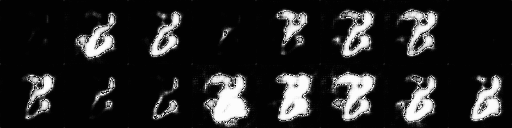

# WGAN Gradient Penalty pytorch implementation

This is a pytorch implementation of the paper (add link to the paper) to get a better understanding of the algorithm and pytorch.

## Train

    At the moment, the only **dataset** to **train** the algorithm is **MNIST**.

    To train the algorithm cd to the root directory of the repository and run:
    ```bash
        cd <root of the repository>
        python train.py
    ```

    Run the following command to check the available hyperparms:

    ```bash
        cd <root of the repository>
        python train.py -h
    ```

### Load pretrained weights

    The weights of the models during the training process are saved in:
    ```bash
        <root of the repo>/runs/weights/<dir of the current training>
    ```
    
    If you want to start training the model with pretrained weights use the following flags when running the train script:
    ```bash
        --gen_pretrained_weights <path to file>/<filename>.pt # For the generator
        --disc_pretrained_weights <path to file>/<filename>.pt # For the discriminator
    ```

    Example:

    ```bash
        python <root of the rempo>/train.py --gen_pretrained_weights <path to file>/<filename>.pt --disc_pretrained_weights <path to file>/<filename>.pt # For the discriminator
    ```

### Training process visualization
    
    The values of the training are saved in <root of the repo>/runs/tensorboard/.
    If you want to visualize the status of the training process, you can use tensorboard by running:

    ```bash
        cd <root of the repo>
        tensorboard --logdir=<root of the repo>/runs/tensorboard/<dir of the current training>
    ```

## Test

    TODO

## Results

    Using the following hyperparms the results have been:

    ```bash
       epochs = 150 
       batch_size = 64 
       learning_rate = 0.00005 
       z_dim = 128
       critic_iters = 5
       clip_value = 0.01
    ```
    
    

    **Please, note that no weights file is available to get these results. You will have to train the algorithm by yourself.**
